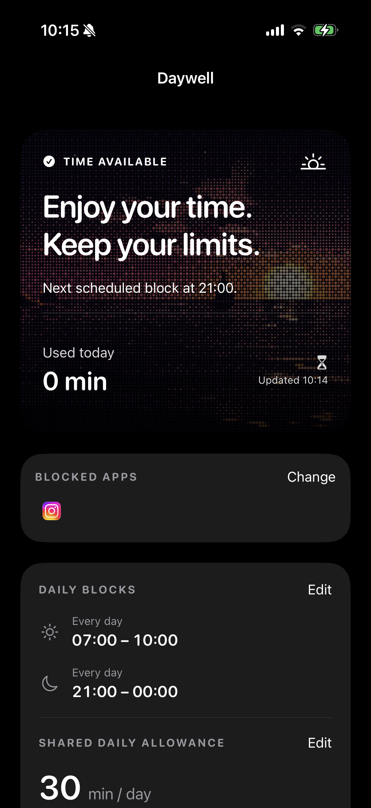
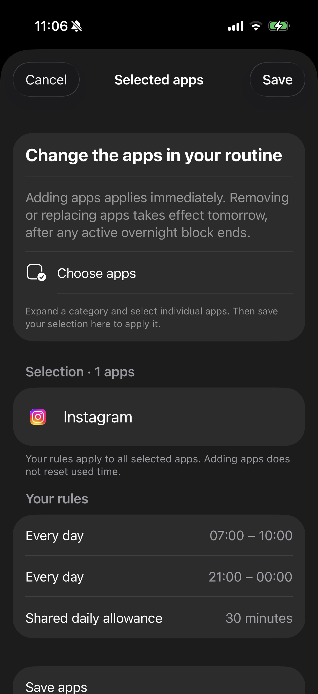
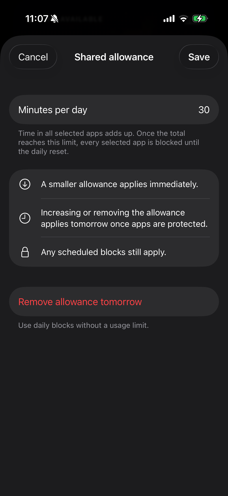

# Daywell

<a href="https://buymeacoffee.com/glebmelnikov"></a>

**Make room for your day.**

Daywell is a free, open-source iPhone app that helps you spend less time doomscrolling. Choose distracting apps such as Instagram, TikTok, or X, set daily blocking windows and a shared time allowance, and let Apple’s Screen Time APIs enforce your routine.

No subscription, account, analytics, advertising, or server. Built with SwiftUI for iOS 17.4 and later.

[Support](https://daywell-support.tunedtoast2.chatgpt.site/support.html) · [Privacy](https://daywell-support.tunedtoast2.chatgpt.site/privacy.html) · [Report an issue](https://github.com/watchmesink/daywell/issues)

## Screenshots

Real iPhone captures of the dashboard, app selection, and shared allowance.

<p>
  
  
  
</p>

## Features

- Block selected apps during up to seven daily windows, including overnight schedules.
- Set one shared daily allowance across all selected apps.
- Use scheduled blocks, an allowance, or both.
- See today’s usage and upcoming rule changes on the dashboard.
- Tighten limits immediately; changes that relax protection wait until the next day after any overnight block.
- Keep app selections and activity on your device.

Daywell uses original code and design, built with SwiftUI and Apple's Screen Time APIs. The source and app icon are [MIT licensed](LICENSE).

The ocean-sunset artwork is adapted from [ascii.rest](https://ascii.rest/ocean-sunset/) by bas3line under its MIT license; see [artwork attribution](docs/ARTWORK.md).

## Your starting routine

Choose one or more installed apps in Apple's private app picker, then activate:

| Rule | Default |
| --- | --- |
| Morning block | Every day, 06:00–10:00 |
| Evening block | Every day, 22:00–00:00 |
| Shared daily allowance | 30 minutes total across all selected apps and sessions |

Scheduled blocks apply to every selected app. Outside those windows, time in all selected apps is added together. For example, 10 minutes in TikTok and 20 minutes in X use the full 30-minute allowance; both apps are then blocked. The blocking screen offers **Close** only.

- Edit apps, daily windows, and the allowance at any time, including during a scheduled block.
- Overnight and overlapping windows are supported. Each window must span at least 15 minutes.
- Schedule edits that retain all existing blocked minutes apply immediately. Edits that free blocked time are saved for the next day, after any occurrence spanning midnight ends.
- Use daily blocks, a shared daily allowance, or both. The combined rules card shows only configured rules, with controls to add missing ones.
- Allowance reductions apply immediately. Once apps are protected, increases or removal take effect at the next budget reset and appear under Upcoming changes. Draft rules can be removed immediately before activation.
- Adding apps applies immediately without resetting the shared allowance. Removing apps takes effect the next day, after any occurrence spanning midnight ends. When replacing apps, additions apply now and removals wait. Upcoming changes shows the target rules and apps, effective dates, and a cancel action; editors reopen with the queued values.
- Today's use includes earlier activity reported by iOS, including activity before initial setup or a monitoring repair.
- Any installed apps can be selected, including Instagram, TikTok, X, and Threads. Up to seven windows leave enough iOS monitor slots to register a replacement before retiring the previous configuration.

**Platform boundary:** the device owner can bypass protection by uninstalling Daywell or revoking Screen Time access in Settings. App signing must remain valid. iOS controls delivery of monitoring callbacks; blocking and usage reporting can be delayed. This is not an unbreakable device-management lock.

## Build and install

Requires macOS, Xcode with an iOS SDK, and iOS **17.4 or later**. The project has no third-party runtime dependencies. Development has been checked with Xcode 26.6 and XcodeGen 2.45.4.

1. Copy `Config/Local.xcconfig.example` to `Config/Local.xcconfig`.
2. Set your Apple Developer **Team ID**, a unique bundle prefix, and a matching App Group. The local file is ignored by Git.
3. Open `Daywell.xcodeproj`, select the **Daywell** scheme and your connected iPhone.
4. Confirm automatic signing, Family Controls, and the shared App Group on the app and extensions. See [the signing guide](docs/SIGNING.md).
5. Build and run. Grant Screen Time access, select the apps you want to block, review your rules, then activate protection.

The checked-in Xcode project can be opened directly. After changing targets or adding source files, regenerate it from `project.yml`:

```sh
xcodegen generate
```

The simulator is useful for inspecting the interface. It cannot establish that Screen Time enforcement works on a real iPhone. Follow the [device validation checklist](docs/DEVICE_VALIDATION.md) before relying on the app.

## Tests and builds

Run the portable rule, persistence, and monitor coordination tests:

```sh
swift test
```

Compile the app and all four extensions without signing:

```sh
xcodebuild -project Daywell.xcodeproj -scheme Daywell \
  -destination 'generic/platform=iOS Simulator' \
  -derivedDataPath build/DerivedData CODE_SIGNING_ALLOWED=NO build
```

`bash scripts/check.sh` runs the tests and simulator build together. [Validation results](docs/VALIDATION.md) distinguish completed checks from pending physical-device checks.

## Project layout

| Location | Responsibility |
| --- | --- |
| `App/` | SwiftUI setup, dashboard, rule editors, and app icon |
| `Sources/BlockingCore/` | Calendar rules, pending edits, persistence, transactional monitor replacement |
| `Shared/` | Apple's Screen Time adapter and shared report context |
| `Extensions/` | Device activity monitor, shield appearance, close-only shield action, usage report |
| `Tests/BlockingCoreTests/` | Tests using a controlled clock and fake monitor driver |
| `Config/` | Build settings, generated Info plists, and entitlements |

See [architecture and limitations](docs/ARCHITECTURE.md) for scheduling, recovery, privacy, and time-zone behavior.

## Publishing

The [App Store release kit](publishing/README.md) contains Family Controls distribution setup, listing copy, review notes, and release status. Version 1.0 (2) was submitted to App Review on October 9, 2026.
